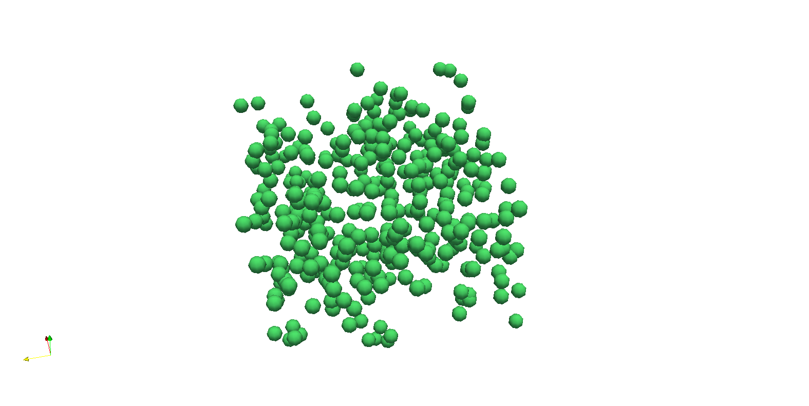

## Read vtu file 

Provide a tool for reading unstructured grid paraview file with python (apply on particle dataSet) 

## Requierement
vtk library

## How to use
Arguments: 
 `$1 [str] path`
 `$1 [str] vtu field Name (default grains_Particles)`

Read all file 
`python Read_vtu_file.py data_example/ test1`

Read a specific file 
`python Read_vtu_file.py data_example/test1_T0.vtu`

Example: `./test.sh` 

to see results on paraview: 
Open dataset: data_example/test1.pvd
Use glyph filter and set for the example a value of 0.0005 for scale factor

## Theory 
None 

## Known Bugs 

## Note

## Authors

* **François Audard** 

## Comments
Please if you have any request or bug please report to me. 

## Annexe
